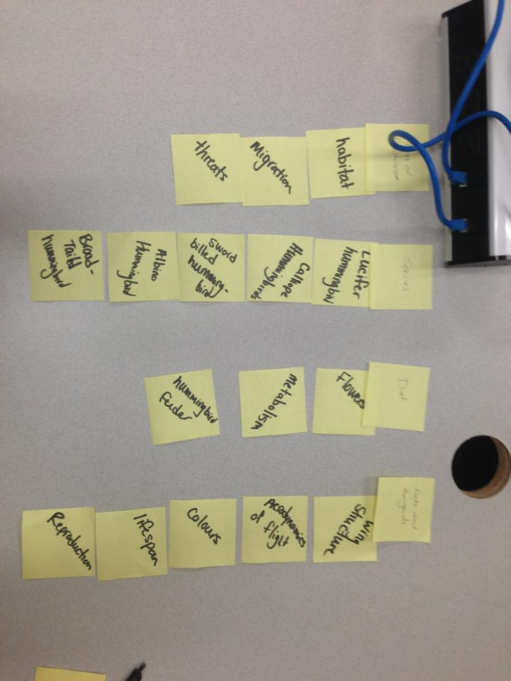
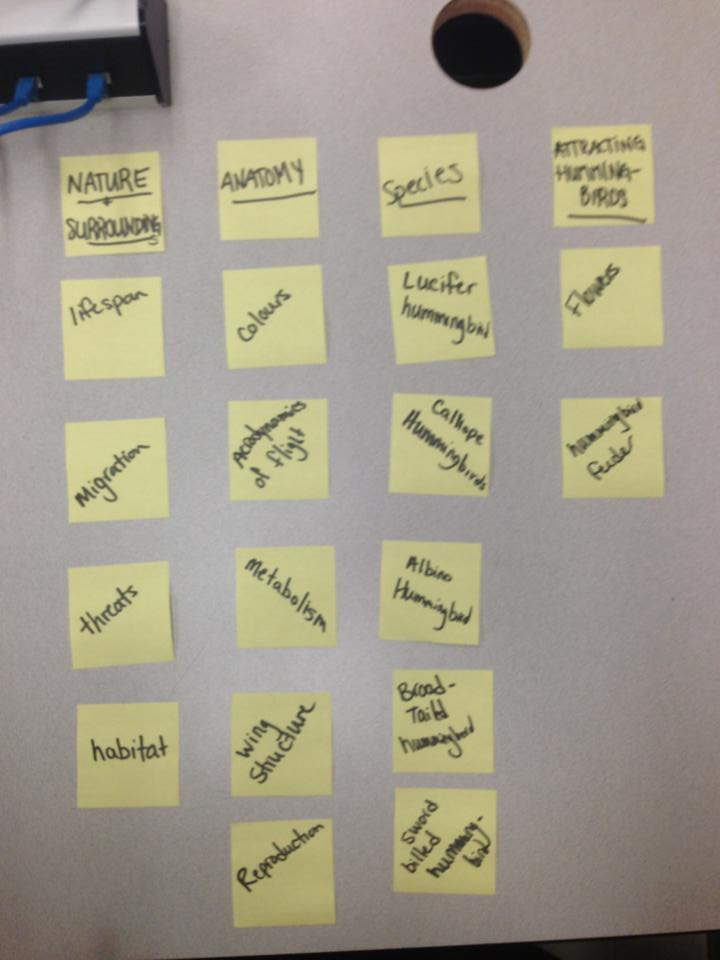

# Card sort report

The purpose of this card sort was to determine common navigation patterns and categories from the content of hummingbirds.

## Specifics

The card sort was conducted by Jenny on September 12th between the times of 2 and 3 with the following participants:

- Lindsay Dupuis 
- Nadia Pietrobon 

## Cards

16 cards were used covering a broad range of applicable content for the website. The following topics were used as cards:

1. habitat
2. metabolism
3. Lucifer Hummingbird
4. where to hang hummingbird feeder
5. lifespan
6. migration
7. Aerodynamics of flight
8. Reproduction
9. Wing structure
10. Sword billled hummingbird
11. colours
12. flowers hummingbirds like
13. Threats
14. Calliope Hummingbird
15. Broad-Tailed Hummingbird
16. Albino Hummingbird

## Card sort results

*Card sort 1 by Lindsay Dupuis*

*Card sort 2 by Nadia Pietrobon*

## Observations

- Did the participants have any common comments?
- Did they have questions that stood out?
- Did they struggle with certain articles or topics?
- Did they find common groupings? Or were the groupings completely different?
- Were some of the groupings completely unexpected?
- Were the results similar to your expectations?
- How did you feel while watching them perform the task?